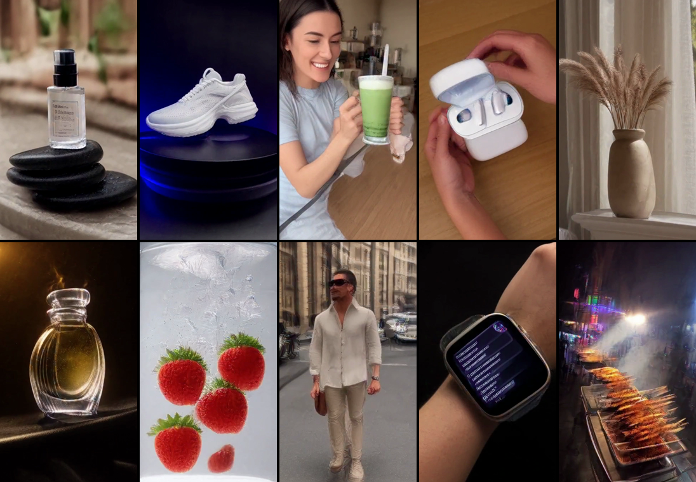

# minimax-h3 — MiniMax-H3 video generation on an 8 GB GPU

Local text/image/reference-to-video (with synchronized stereo audio) using
[MiniMax-H3](https://huggingface.co/MiniMaxAI/MiniMax-H3) open weights and
[stable-diffusion.cpp](https://github.com/leejet/stable-diffusion.cpp), verified on an
**RTX 3070 8 GB / 32 GB RAM / Windows 10**. No ComfyUI, no Python inference stack — one CUDA binary + GGUF weights.



## Quick start

```bat
setup.bat              :: default = max (~140 GB): all Python deps incl. torch, sd.cpp CUDA binaries,
                       ::   Q3 + Q8 FL2VA, Q8 Ref2VA, Q2 + Q4 text encoders, VAEs, both turbo LoRAs, bf16 DiT for baking
setup.bat recommended  :: ~28 GB: Q3 DiT + Q2 text encoder + VAEs + turbo LoRA
setup.bat fast         :: ~25 GB: Q2 DiT + Q2 text encoder + VAEs
setup.bat test         :: ~1.4 GB smoke test (binaries + audio VAE)
```
Binary zips already present in `bin\` are reused (offline install), and `hf download` resumes partial files.

Then either:

```powershell
.\run_t2v.ps1 -Prompt "a cat surfing, cinematic" -W 384 -H 672 -Frames 56 -Steps 8   # one-shot (reloads models each run)
.\start_server.ps1                                                                  # resident server on :1234 (recommended)
python batch_gen.py --out samples                                                   # 10-prompt batch via /sdcpp/v1/vid_gen
```

The server exposes `POST /sdcpp/v1/vid_gen` → `GET /sdcpp/v1/jobs/{id}` (async jobs, cancel, queue position) and a web UI at `http://127.0.0.1:1234/`.

## What runs on 8 GB (measured)

| Config | Time / 2.3 s clip (384×672, 56 f) | Notes |
|---|---|---|
| Q2 DiT, 8 steps, sd-cli | 438 s | 25 GB reloaded from disk every run |
| Q2 DiT, 8 steps, **sd-server resident** | **94 s** | 10-clip batch = 20 min |
| Q3 DiT + turbo LoRA 8-step, er_sde (server) | 158 s | best speed/quality; +50 s LoRA apply per job |
| Q8 DiT, TE Q4, 25 steps, **768×1344 native** (sd-cli) | 1710 s | max quality, photoreal |

VRAM rule of thumb: sampling memory ≈ 0.3–0.35 MB per latent token, tokens = (W/32)·(H/32)·(4k+3) for frames = 17k+5; ceiling ≈ 6.9 GB.
→ 384×672 up to ~10 s, 480×864 up to ~5 s, 768×1344 only ~2.3 s, 1080p impossible on 8 GB.


*Same seed: Q2 base → Q3 base → Q3+LoRA euler → Q3+LoRA er_sde → +spectrum cache*


*Left: Q3+LoRA 384×672 upscaled. Right: Q8 base, 25 steps, 768×1344 native.*

## Scripts

| File | Purpose |
|---|---|
| `setup.bat` | download binaries + models (tiers: fast / recommended / max) |
| `start_server.ps1` | sd-server with H3 resident (`-Dit`, `-LoraApplyMode`) |
| `batch_gen.py` / `hq_gen.py` | batch prompts / quality matrix through the server API |
| `run_t2v.ps1` | one-shot render with sd-cli |
| `run_max.ps1` | max-quality render (Q8, TE Q4, 768p, `-RefImg` for Ref2VA, `--params-backend te=disk`) |
| `bake_lora.py` + `bake_chain.ps1` | bake a LoRA into the bf16 DiT (streaming, exact) and re-quantize to Q8_0 |
| `story15.ps1` | 15 s storyboard: 3×5 s shots, Ref2VA for product/character consistency, ffmpeg assembly |
| `NOTES.md` | all measured timings, VRAM limits, gotchas |

## Gotchas

- `cfg-scale` must be `1.0` (H3 is CFG-free); frames snap to `17k+5`; dims multiple of 32; 24 fps fixed.
- Server LoRA: pass `lora:[{path:"<file name inside --lora-model-dir>", multiplier:1.0}]` — absolute paths are rejected.
- `--lora-apply-mode immediately` crashes with quantized GGUF; keep `auto`.
- Stop `sd-server` before `run_max.ps1` (it holds ~7 GB VRAM and ~25 GB RAM).
- Model files on an HDD cost ~3–5 min per load; keep the server resident.

## License

Scripts: MIT. Model weights: [MiniMax H3 Community License](https://huggingface.co/MiniMaxAI/MiniMax-H3/blob/main/LICENSE)
(not available in the US, EU, UK, South Korea without a separate license); stable-diffusion.cpp: MIT.
